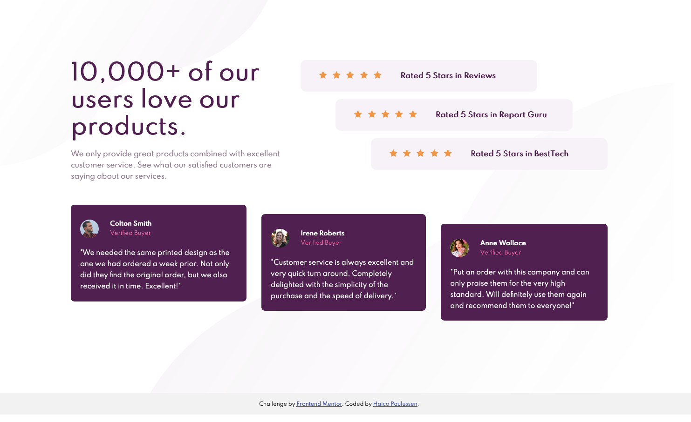

# Frontend Mentor - Social proof section solution

This is a solution to the [Social proof section challenge on Frontend Mentor](https://www.frontendmentor.io/challenges/social-proof-section-6e0qTv_bA). Frontend Mentor challenges help you improve your coding skills by building realistic projects. 

## Table of contents

- [Overview](#overview)
  - [The challenge](#the-challenge)
  - [Screenshot](#screenshot)
  - [Links](#links)
- [My process](#my-process)
  - [Built with](#built-with)
  - [What I learned](#what-i-learned)
- [Author](#author)


**Note: Delete this note and update the table of contents based on what sections you keep.**

## Overview

### The challenge

Your challenge is to build out this social proof section and get it looking as close to the design as possible.

You can use any tools you like to help you complete the challenge. So if you've got something you'd like to practice, feel free to give it a go.

Your users should be able to:

- View the optimal layout for the site depending on their device's screen size


### Screenshot



### Links

- Solution URL: [My Frontend Mentor solution](https://www.frontendmentor.io/solutions/responsive-social-proof-page-with-css-flexbox-mobile-first-JmCzdN_D1)
- Live Site URL: [Github Pages](https://haico-paulussen.github.io/social-proof-flexbox/)

## My process

### Built with

- Semantic HTML5 markup
- CSS custom properties
- Flexbox

### What I learned
This time I really focussed on CSS Flexbox. I think it worked out really well. After some tutorials it was a great challenge to practice my Flexbox skills. 

```css
.section-card {
    display: flex;
    flex-direction: column;
    align-items: center;
    gap: 2rem;
}

body .rating:nth-of-type(3) {
        align-self: flex-end;
}
```

### Continued development

It's time for my next step! I want to learn CSS Grid. I feel like I know Flexbox so it's time for Grid.  

Long term speaking, I want to (re-)learn JavaScript; Vue.js, nuxt.js and maybe other framworks.

## Author

- LinkedIn - [Haico Paulussen](https://www.linkedin.com/in/haico-paulussen-160281158/)
- Frontend Mentor - [@Haico-Paulussen](https://www.frontendmentor.io/profile/Haico-Paulussen)
